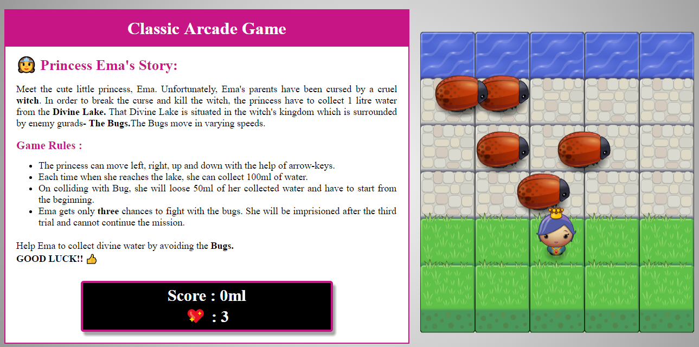

# Classic Arcade Game

### Project Summary

This is the submission for Udacity's Classic Arcade Game Project for the **Front-End Web Developer Nanodegree.** This is a basic "Frogger" style game where the goal is to reach a certain destination while avoding a fleet of enemies that cross the screen.

### Princess Ema's Story:

Meet the cute little princess, Ema. Unfortunately, Ema's parents have been cursed by a cruel witch. In order to break the curse and kill the witch, the princess have to collect 1 litre water from the Divine Lake. That Divine Lake is situated in the witch's kingdom which is surrounded by enemy gurads- The Bugs.The Bugs move in varying speeds. 
#### Game Rules :

* The princess can move left, right, up and down with the help of arrow-keys.
* Each time when she reaches the lake, she can collect 100ml of water.
* On colliding with Bug, she will loose 50ml of her collected water and have to start from the beginning.
* Ema gets only three chances to fight with the bugs. She will be imprisioned after the third trial and cannot continue the mission.

**Help Ema to collect divine water by avoiding the Bugs.** 
### GOOD LUCK!! 👍

